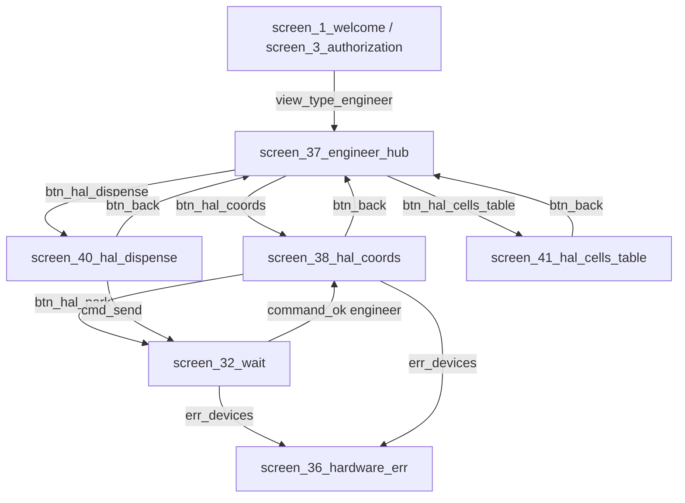

# План миграции: RPi + ATmega (HAL)

Перенос логики выдачи и координат с монолитного `.ino` на клиент PyQt5; ATmega — только исполнение по UART.

**Базовая линия:** актуальная прошивка `no_block_plata.ino` и протокол из раздела «Справочник: протокол UART» (таблица **А**) принимаются как основа работы клиента; изменения протокола или прошивки вносятся по мере необходимости и отражаются здесь же.

**Статус в чекбоксах:** `[x]` сделано, `[ ]` не сделано, `[~]` этап частично (есть и сделанное, и открытые подзадачи).

**Ссылки:** [hardware_barcode_relay_dispensing.md](hardware_barcode_relay_dispensing.md), [client_components_description.md](client_components_description.md).

---

## Легенда

| Поле | Значение |
|------|----------|
| **Статус этапа** | Краткая отметка по этапу в целом |
| Подзадачи | Отдельные чекбоксы |

---

## Наследие (кратко)

Сейчас контроллер: `SerialManager` + `$<номер>\r\n` и ответы `command_is_send` / `command_ok` (см. `serial_manager.py`, `action_cmd.py`, `state_map.py`). Сканер — второй порт. Известные долги: запись в COM из GUI, заглушки `write_db_err_*`, реле на `screen_14_stockman` параллельно будущему `$LOCK`.

**HAL-координаты (этап 2):** без явных `hal_x`/`hal_z` в `Cell` (и не `(0,0)`) выдача по `atmega_hal` не стартует — `err_devices` → `screen_36_hardware_err`, UART не трогаем (`EventsSystem/hal_coords.py`, `read_db_get_cell`, `cmd_send`).

---

## Справочник: протокол UART

### А. Текущая прошивка (`client/MegaHardware/no_block_plata.ino`)

Строки команд с ведущим `$`, ответы — текст + `\n` (клиент шлёт `\n`, см. `vending_serial_manager.py`).

**К плате (основной HAL-набор):**

| Команда | Назначение |
|---------|------------|
| `$ZERO` | Поиск нуля по концевикам, все оси; долгая операция |
| `$MOT,p1,p2,p3,p4,p5` | Пять целевых позиций (шаги) для моторов 1…5 за один кадр; неподвижные оси — **текущая** позиция с той же строкой (повтор последних координат) |
| `$LOCK,ms` | Импульс замка/люка: удержание выхода `ms` миллисекунд (**`delay(ms)` в обработчике** — до конца паузы новые команды UART не разбираются), затем ответ |
| `$LED,0` / `$LED,1` | Лента/подсветка через сдвиговый регистр |
| `$RGB,r,g,b` | Адресная лента (0–255 на канал) |
| `$SOL,ms` | Соленоид, импульс `ms` с блокирующим `delay` |

**Наследие монолита (на той же прошивке):** `$c,n`, `$f`, `$g` — внутренняя логика ячеек `goo()`; для сценария RPi+HAL не используются.

**От платы:**

| Ответ | Когда |
|--------|--------|
| `WAIT` | Начало длинной операции: после приёма `$ZERO` и сразу после приёма корректного `$MOT,…` (до фактического движения) |
| `DONE` | Успешное завершение: `$ZERO`, `$MOT`, `$LOCK`, `$LED`, `$RGB`, `$SOL` |
| `ERROR` | Ошибка разбора `$MOT` (например позиция > 999999) или срабатывание концевика вне штатного хода в `motRun()` |
| `UNKNOWN COMMAND` | Неизвестная строка после `$` (в т.ч. команды «эталона», которых нет в прошивке) |

Для `$LOCK,ms` и `$SOL,ms` **нет** строки `WAIT` — только пауза внутри `loop` и затем **`DONE`**.

**Клиент:** `VendingSerialManager` для `$ZERO` / `$MOT,…` принимает **`WAIT` или `OK`** как первую фазу, затем **`DONE`** / **`ERROR`** (как в таблице **А**).

### Б. Эталон на будущее (расширения)

По мере развития: `$STOP` вне цикла `$g`, отдельный `$DISP,ms`, неблокирующий `$LOCK`, `$SENS1`…`$SENS6`, при необходимости `$LOCK0`/`$LOCK1` + строки `LOCK ON`/`LOCK OFF` — см. исторические требования в git/обсуждениях. Приёмка клиента к железу — по таблице **А** и стенду.

---

## Кинематика (оси в прошивке и смысл для сценария выдачи)

В массиве моторов `motor[0..4]` ↔ **MOT1…MOT5** в команде `$MOT,…`:

| Индекс | Роль (механика) |
|--------|-----------------|
| 0, 1 (MOT1, MOT2) | **hal_z** (дублируются на обе оси передней каретки) |
| 2 (MOT3) | **hal_x** (задняя ось X, целевая координата из БД) |
| 3 (MOT4) | **hal_x − 25** (вторая ось X, смещение фиксировано в `hal_coords.py`) |
| 4 (MOT5) | Штырь: при выдаче **60**, затем **0** (`HAL_DISPENSE_PUSH_DOWN` / `UP`) |

Один кадр `$MOT,p1,p2,p3,p4,p5` вызывает **параллельный** доезд всех осей с ненулевым перемещением до целей (`motRun()`). Поэтому **упорядочивание «сначала только Z, потом только X»** делается **несколькими** последовательными кадрами `MOT`, в каждом из которых для «ожидающих» осей подставляются **уже достигнутые** координаты (или текущие, если ось не трогаем).

**Рекомендуемая логика последовательности кадров** (подбирается на стенде с учётом габаритов):

1. **Безопасная высота/зона** задней каретки (MOT3,4), если передней (MOT1,2) иначе упрётся в механику — часто первый кадр задаёт «заднюю» позицию в безопасной точке, передняя на парковке или на промежуточной точке.
2. **Подъезд** к ячейке одним кадром `MOT`: **M1=M2=hal_z**, **M3=hal_x**, **M4=hal_x−25**, **M5=0** (`hal_dispense_target_mot5` в `EventsSystem/hal_coords.py`). Координаты **обязательны** в `Cell` (см. задачи этапа 2 про отказ от fallback).
3. **Задняя каретка** в положение захвата/подъёма ячейки (если цикл требует задней фазы отдельно от передней).
4. **Штырь MOT5:** отдельные кадры **60** (выталкивание) и **0** (подъём) при неизменных M1…M4.
5. **Отвод** в парковку: обычно сначала штырь вверх, затем отвод передней/задней в конфигурируемые `park_*`, чтобы не цеплять ячейку.
6. **`$LOCK,ms`** после того, как каретка у окна выдачи в нужном положении (как в текущем Python-сценарии после движений).

Текущая реализация в `action_cmd._build_hal_dispense_steps`: цепочка **`LED` → несколько `MOTn,x` по одной оси** → **`LOCK,ms`** — это **не совпадает** с форматом `$MOT,p1..p5` на прошивке; перенос на общий кадр — открытые задачи **этапов 1–2**.

### Про `$ZERO` перед каждой выдачей

Полный `$ZERO` — это **объезд всех осей в нуль по концевикам**, долго и изнашивает механику. Если «окно выдачи» не совпадает с механическим нулём, это решают **смещениями и целевыми координатами в конфиге/БД** (`hal_x`, `hal_z`, парковка), а не обязательным нулением перед каждой выдачей.

Имеет смысл: **`$ZERO` при старте приложения** (как в startup-контракте) и **после сбоя** (потеря шагов, `ERROR`, ручной стоп); **перед каждой выдачей** — только если по опыту эксплуатации накопление ошибки без энкодеров критично; иначе чаще достаточно одной калибровки сессии и стабильных абсолютных кадров `MOT`.

---

## Этап 1. Клиент: драйвер, мок, интеграция

**Статус этапа:** `[x]` драйвер и мок синхронизированы с `no_block_plata` (WAIT/DONE, LED/RGB только DONE, LOCK/SOL таймаут по ms, стартовый контракт без LOCK1)

|  | Задача |
|--|--------|
| [x] | Модуль `client/BarcodeScanner/vending_serial_manager.py` (построчное чтение, очередь TX, один полёт команды, `command_finished(cmd, outcome)`, таймауты, сигналы Qt) |
| [x] | Модуль `client/BarcodeScanner/dispense_command_gate.py` (вариант A: строго последовательные шаги, корреляция с `command_finished`, `threading.Lock`, без emit под lock) |
| [x] | `MockVendingSerialManager` (`client/BarcodeScanner/MockVendingSerialManager.py`): `OK`/`DONE`/`ERROR`, `LOCK ON`/`OFF`, `SENS`, `MOCKFAIL` |
| [x] | Флаг `hardware.protocol` в `config.json`: `legacy` \| `atmega_hal` (выбор в `main.py`; env `AUTOSKLAD_USE_MOCKS` по-прежнему включает моки) |
| [x] | Подключение в `main.py`: контроллер → `VendingSerialManager` / мок HAL, `start()`, `executor.controller_protocol`, опционально `hal_test_scenario_path` + `DispenseCommandGate` |
| [x] | `Executor` / `MainWindow`: для `atmega_hal` в `button_clicked` только мост `fsm_trigger` (`command_is_send` / `command_ok` / `err_devices`); полный сценарий выдачи — **этап 2** (`action_dispense` + gate) |
| [x] | Унификация отправки: `Executor.send_controller_command` → `enqueue_command` (HAL) или `command_queue` (legacy); `action_cmd.cmd_send` через него |
| [x] | `VendingSerialManager` / мок: для **`$ZERO`** и **`$MOT,…`** принимать **`WAIT` как ack** (аналог текущего `OK`), затем **`DONE`** / **`ERROR`**; строка **`WAIT`** не должна попадать в `unknown_line` |
| [x] | **`$RGB`** и **`$LED,0|1`**: на прошивке после команды сразу **`DONE`**, без **`WAIT`** и без **`OK`** — завершать полёт по **`DONE`** (и по **`ERROR`**); не требовать двухфазного ack там, где плата его не шлёт |
| [x] | **`$LOCK,ms`** и **`$SOL,ms`**: плата молчит до конца блокирующего **`delay(ms)`**; не использовать короткий **`ack_timeout_s`** как для мгновенных команд — помечать как **длинные** с дедлайном **≥ ms** (или отдельная ветка таймаута по аргументу команды), иначе **`timeout_ack`** при типичных 10–15 с |
| [x] | Стартовый контракт `cmd_test_self`: привести к ответам прошивки (`WAIT`/`DONE`, нет `LOCK1`) — либо расширить прошивку под `LOCK0`/`LOCK1`, либо убрать эти шаги и заменить на `$LED`/`$MOT,…` парковку |
| [x] | Мок `MockVendingSerialManager`: опция эмулировать ответы как у **`no_block_plata`** (`WAIT`/`DONE`, формат **`MOT,…`**) для регрессионных тестов без железа |

---

## Этап 2. БД, кинематика, FSM

**Статус этапа:** `[x]` сценарий выдачи на `no_block_plata` готов; валидация `hal_x`/`hal_z` без fallback на `Cell.number`

|  | Задача |
|--|--------|
| [x] | Кинематика вынесена в `config.json` (`hardware.hal_motion_profile`, per-cell профиль в `cells`), legacy `Cell.number` сохранён без изменений |
| [x] | Старт приложения: `$ZERO` до допуска логина (startup-контракт для `atmega_hal`: проверка связи, `ZERO`, парковка **`MOT,0,0,0,0,0`**; при сбое — `err_devices`) |
| [x] | HAL-сценарий выдачи в `cmd_send`: свет → кадры **`MOT,p1..p5`** (опц. задняя безопасная) → передняя к ячейке → штырь → парковка → **`$LOCK,ms`**; исполнение через `DispenseCommandGate` |
| [x] | **`_build_hal_dispense_steps` + gate:** собрать движения в последовательность кадров **`MOT,p1,p2,p3,p4,p5`** (учёт текущих/парковочных пяти координат на клиенте или запрос состояния с платы, когда появится); увязать порядок кадров с геометрией передней/задней каретки и штыря (см. раздел «Кинематика» выше) |
| [x] | Профиль конфига/БД: **`park_m1..park_m5`** в `hal_motion_profile` или **`park_x`/`park_z`/`push_up`** по осям из `HardwareConfig`; цели ячейки **`hal_x`/`hal_z`** на оси передней каретки |
| [x] | **`LED` / `RGB`:** шаг **`$LED,0|1`** (ненулевой `led` из БД → «вкл»); опционально **`rgb_issue_r/g/b`** в профиле → шаг **`$RGB,r,g,b`** |
| [x] | **`command_ok` и `lock_ms`:** убрано **двойное ожидание** — после `$LOCK,ms` на MCU пауза уже отработана до **`DONE`**, клиент шлёт **`command_ok`** сразу по завершении цепочки |
| [x] | Комментарии в **`action_cmd.py`** (в т.ч. про «**`LOCK`** без **`DONE`**»): привести к факту прошивки (**только `DONE`** после паузы) |
| [x] | FSM-секвенсор для HAL: мгновенный переход в wait (`command_is_send`), успех по отложенному `command_ok`, ошибки/таймауты через `err_devices` |
| [x] | Списание в БД синхронизировано с `$LOCK,ms`: `command_ok` после **полной** HAL-цепочки (включая `DONE` по `$LOCK,ms`), **без** дополнительного `QTimer(lock_ms)` на клиенте |
| [x] | `ERROR`/таймаут: стоп сценария, без списания, запись в `Error`, реализованы `write_db_err_devices` / `write_db_err_timeout` с переходом в аппаратную ошибку |
| [x] | Экран «Сбой механики» (`screen_36_hardware_err`): только кнопка возврата, без retry/инженерного меню; подключён в FSM по `err_devices`/таймаутам |
| [x] | **Убрать fallback координат** в `_build_hal_dispense_steps` / `cmd_send`: не подставлять `Cell.number` в `hal_x` и `0` в `hal_z`, если в БД `NULL` |
| [x] | **Валидация перед UART:** для ячейки выдачи требовать заданные `hal_x` и `hal_z` (`IS NOT NULL`); если **оба равны 0** — считать координаты невалидными (не запускать `DispenseCommandGate`) |
| [x] | **FSM при невалидных координатах:** до `cmd_send` (в `read_db_get_cell` / `read_db_get_more_cells` или в `cmd_send` при сборке шагов) — `err_devices` или отдельный триггер → `write_db_err_devices` → **`screen_36_hardware_err`** (без списания в `Consumption`) |
| [x] | Запись в `Error` / лог: причина `missing_hal_coords` / `zero_hal_coords`, `cell_id`, `number` — для синка и разбора на стенде |

**Правило приёмки (координаты):** выдача по `atmega_hal` возможна только при `hal_x`, `hal_z` из БД и `(hal_x, hal_z) ≠ (0, 0)`; иначе пользователь видит экран аппаратной ошибки, UART не трогаем.

---

## Этап 3. UI и инженерное меню

**Статус этапа:** `[x]` реализовано

**Цель:** отдельное меню для роли **Engineer** (не расширять `screen_6_user` / `screen_26_admin`). UART и последовательность `MOT` — только через `action_cmd` + FSM; GUI шлёт триггеры, не строки в COM напрямую.

**Роль и вход:** в `screen_1_welcome` / `screen_3_authorization` — триггер `view_type_engineer` → домашний экран **`screen_37_engineer_hub`** (сейчас Engineer ошибочно ведёт на `screen_6_user` как `test_user`).

**Паттерны UI (как в проекте):** экран = `BaseScreen` + `Ui_*` из `.ui`; кнопки в `StateMachine/screens.py` + переходы в `state_map.py`; списки — `QListWidget` + `setItemWidget` (`screen_8`, `screen_33`); цифровой ввод — overlay `WidgetKeyboard` (`screen_3`) или встроенные `btn_number_*` (`screen_28`); на всех экранах инженерного раздела внизу **`btn_back`** с иконкой `GUI/ui/img/btn_ico_back.png` (как в `screen_22_users.ui`).

### Экраны

| Экран | Назначение |
|-------|------------|
| **`screen_37_engineer_hub`** | Хаб: 3 кнопки — «Координаты», «Выдача», «Таблица ячеек»; ФИО инженера; `btn_back` → `screen_1_welcome` |
| **`screen_38_hal_coords`** | Меню координат, JOG, сохранение в БД, **парковка** (см. ниже) |
| **`screen_32_wait`** | **Переиспользуется** при парковке и тестовой выдаче (ожидание UART); GIF + подпись; без отдельного `screen_39_hal_park` |
| **`screen_40_hal_dispense`** | Тестовая выдача по номеру ячейки |
| **`screen_41_hal_cells_table`** | Список/таблица `hal_x` / `hal_z` по ячейкам из БД |

#### `screen_38_hal_coords` — меню координат

| Элемент UI | Поведение |
|------------|-----------|
| Лейбл **M1…M5** | Текущие координаты (после каждого `command_finished`; до появления `$POS` на прошивке — последние подтверждённые/отправленные шаги с пометкой в UI) |
| **Парковка** (`btn_hal_park`) | FSM: `cmd_hal_zero` (цепочка как в startup: `$ZERO`, затем `$MOT,0,0,0,0,0`) → `command_is_send` → **`screen_32_wait`** (подпись через `set_data`, напр. «Парковка…»). По `command_ok` — **возврат на `screen_38_hal_coords`**, без `write_db_tool_consumption` |
| Поле **номер ячейки** | `QLineEdit` + кнопка клавиатуры → overlay **`WidgetKeyboard`** (как `screen_3`) или выбор из всплывающего диалога |
| **Сохранить координаты** | `write_db_cell_hal_coords`: **hal_z** ← MOT1, **hal_x** ← MOT3 (M2=M1, M4=M3−25 на шине) |
| **JOG** (виджет `WidgetHalJogPanel`) | **Z** — MOT1+MOT2; **X** — MOT3+MOT4 (с сохранением смещения −25); **Y** — MOT5. Команды → `cmd_hal_jog` |
| `btn_back` | → `screen_37_engineer_hub` |

**Важно для FSM:** сейчас `screen_32_wait` + `command_ok` ведёт в `write_db_tool_consumption` (сценарий пользовательской выдачи). Для инженера нужна **ветка контекста** (флаг сессии / отдельный триггер `command_ok_engineer`): парковка и тестовая выдача с `screen_40` не должны списывать `Consumption`.

#### Парковка — только через `screen_32_wait`

Отдельный экран **`screen_39_hal_park` не делаем.** Долгая операция `$ZERO` + парковочный кадр `MOT` — тот же UX ожидания, что при выдаче: `screen_32_wait.py` (анимация, блокировка лишних кнопок). Отличие — только целевое состояние после успеха (`screen_38_hal_coords`, а не `screen_11_tool_issued`).

#### `screen_40_hal_dispense` — тестовая выдача

| Элемент | Поведение |
|---------|-----------|
| Ввод номера ячейки | Постоянное поле + `WidgetKeyboard` (предпочтительно для стенда) или отдельный шаг выбора |
| **Выдать** | `read_db_get_cell` по номеру (или упрощённый lookup) → `cmd_send` с `cell_id`; валидация `hal_coords` как в этапе 2 |
| Ожидание | `command_is_send` → **`screen_32_wait`** → при успехе инженерной ветки — возврат на `screen_40` или сообщение «готово», **без** записи расхода в продуктивном режиме (режим «тест» в `action_cmd` / отдельный флаг) |
| `btn_back` | → `screen_37_engineer_hub` |

#### `screen_41_hal_cells_table` — массив координат

| Элемент | Поведение |
|---------|-----------|
| Список | `QListWidget` + строковый виджет **`WidgetCellHalRow`** (номер, `hal_x`, `hal_z`, метка NULL / (0,0)); `enable_touch_scroll = True` |
| Данные | `read_db_cells_hal_list` в `action_db` |
| Тап по строке (опц.) | Переход на `screen_38_hal_coords` с подставленным номером ячейки |
| `btn_back` | → `screen_37_engineer_hub` |

### Слой логики (новые состояния FSM / actions)

| Состояние / action | Назначение |
|--------------------|------------|
| `cmd_hal_zero` | Парковка: `$ZERO` + `MOT,0,0,0,0,0` (таймауты как в `cmd_test_self`) |
| `cmd_hal_jog` | Короткий кадр `MOT,…` со сдвигом одной логической оси |
| `write_db_cell_hal_coords` | `EngineCell.update_cell_hal_profile` |
| `read_db_cells_hal_list` | Выборка ячеек с `number`, `hal_x`, `hal_z`, `cell_id` |

Ошибки HAL → `err_devices` → `write_db_err_devices` → **`screen_36_hardware_err`** (уже есть).

### Чеклист реализации

|  | Задача |
|--|--------|
| [ ] | Роль **Engineer**: `view_type_engineer` в welcome/authorization → `screen_37_engineer_hub` |
| [ ] | UI: `screen_37`, `screen_38`, `screen_40`, `screen_41` (`.ui` + `screen_*.py` + `ui.py` + `screens.py`) |
| [ ] | Виджеты: `WidgetHalJogPanel`, `WidgetCellHalRow`; переиспользование `WidgetKeyboard` на `screen_38` / `screen_40` |
| [ ] | Единый **`btn_back`** с `btn_ico_back.png` на экранах 37–41 |
| [ ] | FSM: переходы хаб ↔ дочерние экраны; **`btn_hal_park`** → `cmd_hal_zero` → **`screen_32_wait`** → возврат на `screen_38` |
| [ ] | FSM: **контекст инженера** для `screen_32_wait` — `command_ok` не в `write_db_tool_consumption` при парковке/тесте |
| [ ] | `action_cmd`: `cmd_hal_zero`, `cmd_hal_jog`; учёт текущего вектора M1…M5 на клиенте |
| [ ] | `action_db`: `write_db_cell_hal_coords`, `read_db_cells_hal_list` |
| [ ] | Согласовать GPIO реле кладовщика (`screen_14_stockman`) с `$LOCK` (убрать дублирование или разнести контуры) |
| [ ] | (Позже) SPEED/BOOST, опрос `$SENS` — после базового JOG и сохранения координат |

**Не делать:** расширять `screen_26_admin` под JOG; вешать HAL на `screen_6_user`; отдельный экран `screen_39_hal_park`.

**Правило приёмки (инженер):** Engineer после входа видит только хаб и три раздела; парковка показывает `screen_32_wait` до `DONE`/`ERROR`; сохранение координат пишет `hal_x`/`hal_z` в `Cell`; тестовая выдача уважает валидацию координат этапа 2; UART из GUI не вызывается.

---

## Этап 4. Документация и приёмка

**Статус этапа:** `[ ]` не начато

|  | Задача |
|--|--------|
| [ ] | Обновить `docs/hardware_barcode_relay_dispensing.md` под фактический протокол |
| [ ] | **DoD:** полный цикл на моке; на стенде выдача из БД по **`hal_x`/`hal_z`** (без fallback); отказ выдачи при NULL/(0,0) → `screen_36_hardware_err`; `$ZERO` при старте; **`screen_37`–`41` + парковка через `screen_32_wait`**; ошибки в `Error` и синк |

---

## Риски (кратко)

| Риск | Мера |
|------|------|
| Несколько `DONE` / рассинхрон | Последовательный gate + корреляция `command_finished` |
| Обрыв строк / буфер | Только `readline`, не `read_all` для текста |
| Долгий `$LOCK` на прошивке | UART не обслуживается во время `delay(ms)`; на клиенте — таймауты и учёт блокировки очереди; в перспективе — неблокирующий lock в прошивке |
| Расхождение `OK` vs `WAIT` | В драйвере трактовать `WAIT` как ack длинной команды; мок опционально эмулировать оба варианта |
| Выдача с `hal_x`/`hal_z` = NULL или (0,0) | Убрать fallback на `number`; блокировать до UART, экран `screen_36_hardware_err`, запись в `Error` |

---

## Карта файлов

| Назначение | Путь |
|------------|------|
| Драйвер v0 | `client/BarcodeScanner/vending_serial_manager.py` |
| Очередь шагов выдачи | `client/BarcodeScanner/dispense_command_gate.py` |
| Старый COM | `client/BarcodeScanner/serial_manager.py` |
| Мок legacy / HAL | `client/BarcodeScanner/MockSerialManager.py`, `client/BarcodeScanner/MockVendingSerialManager.py` |
| HAL-сценарий выдачи / старт железа | `client/EventsSystem/action_cmd.py` |
| Вход в приложение | `client/main.py`, `client/EventsSystem/Executor.py`, `client/GUI/MainWindow.py` |
| FSM | `client/StateMachine/state_map.py` |
| Инженерное меню (план) | `screen_37_engineer_hub`, `screen_38_hal_coords`, `screen_40_hal_dispense`, `screen_41_hal_cells_table`; ожидание — `screen_32_wait` |
| Валидация HAL-координат | `client/EventsSystem/hal_coords.py` |
| БД ячеек | `client/DB/Models/Cell.py`, `client/DB/Engine/CellCRUD.py` |
| Прошивка (текущая в репозитории) | `client/MegaHardware/no_block_plata.ino` |

---

*Номера моторов, мм↔шаги и тайминги фиксируются в спецификации станка и в ревизии прошивки.*
