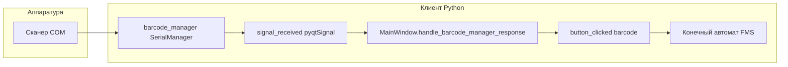
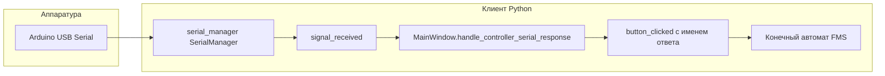
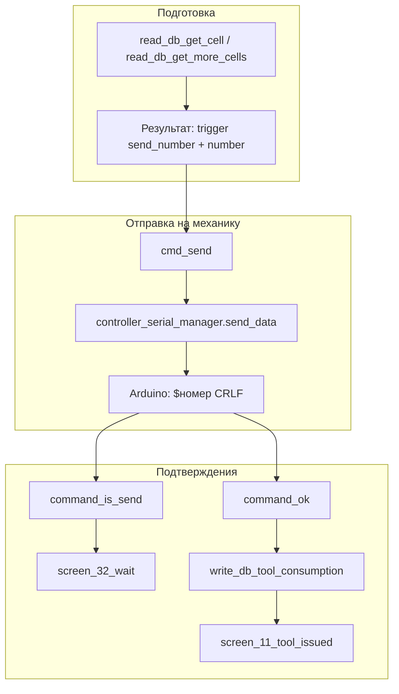

# Сканер штрих-кодов, реле замка, выдача инструмента и связь с Arduino

Подробное описание подсистем клиента AutoSklad: последовательные порты, конечный автомат (FMS), бизнес-логика в БД и прошивка механики. Дополняет обзор в [client_components_description.md](client_components_description.md) (раздел «Hardware Managers»).

---

## 1. Обзор

В [client/main.py](client/main.py) создаются **два независимых экземпляра** класса [SerialManager](client/BarcodeScanner/serial_manager.py):

| Экземпляр | Назначение | Порт (пример конфигурации) |
|-----------|------------|----------------------------|
| `serial_manager` | Обмен с контроллером выдачи (Arduino и т.п.) | Windows: `config.json` → `serial.port`; Linux/RPi: `dev.ttyUSB` |
| `barcode_manager` | Данные со сканера штрих-кодов / QR | Windows: `barcode.port`; Linux/RPi: `dev.serial` |

Оба потока запускаются через `.start()`, подключаются к [Executor](client/EventsSystem/Executor.py): `attach_serial_manager` и `attach_barcode_manager`. Ответы с портов приходят в [MainWindow](client/GUI/MainWindow.py) разными обработчиками и превращаются в **триггеры FMS** через `button_clicked`.

**Важно:** класс `SerialManager` один и тот же для сканера и для контроллера. Формат строк на порту контроллера (`$…`, ответы `1`/`2`) и формат данных сканера (текст штрих-кода) различаются; при неверной настройке портов возможна путаница протоколов.

### 1.1. Поток данных: сканер → GUI → FMS



После прихода строки с порта сканера в `handle_barcode_manager_response` сохраняется `self.value['barcode'] = response` и вызывается `button_clicked('barcode', None)`, что переводит автомат по переходу с триггером `barcode` из текущего экрана (например, с приветствия на `read_db_user_from_barcode`).

### 1.2. Поток данных: контроллер выдачи → FMS



В [serial_manager.py](client/BarcodeScanner/serial_manager.py) метод `raw_read_data()` при формате `$…\n` эмитит строки `command_is_send` и `command_ok` (см. раздел 5). `handle_controller_serial_response` вызывает `button_clicked(response, None)`, то есть **имя триггера совпадает с текстом ответа** (`command_is_send`, `command_ok`).

### 1.3. Сводная схема выдачи инструмента (FMS + БД + COM)



Точные переходы заданы в [state_map.py](client/StateMachine/state_map.py) (см. раздел 4).

---

## 2. Управление сканером штрих-кодов

### 2.1. Класс SerialManager

Файл: [client/BarcodeScanner/serial_manager.py](client/BarcodeScanner/serial_manager.py).

| Элемент | Описание |
|---------|----------|
| Наследование | `threading.Thread`, `QObject` — фоновый цикл + сигналы Qt |
| `signal_received` | `pyqtSignal(str)` — данные для GUI |
| `command_queue` | Очередь команд вида `send:<payload>`; в цикле `run()` извлекается и вызывается `send_data` |
| `send_data(data)` | Запись в порт: `"$" + str(data) + "\r\n"` |
| `raw_read_data()` | `read_all()`; если буфер вида `$…\n`, декодирует середину; цифры `1`/`2` маппятся в `command_is_send` / `command_ok` |
| `read_data()` | `readline()`; целочисленные строки `1`/`2` → те же сигналы (альтернативный путь парсинга) |

Для **сканера** на порте обычно ожидается текст штрих-кода (часто с завершающим Enter). Если сканер шлёт не `$…` и не `1`/`2`, сработает ветка «Некорректный формат» в `raw_read_data` или сигнал уйдёт как есть из `read_data` — поведение зависит от того, какой метод реально используется в цикле. В `run()` вызывается **`raw_read_data()`**, поэтому ответы контроллера и «сырой» ввод сканера обрабатываются одной логикой.

### 2.2. Подключение в main и Executor

- [client/main.py](client/main.py): создание портов, `start()`, `executor.attach_barcode_manager(barcode_manager)`, переопределение `executor.handle_barcode_manager = window.handle_barcode_manager_response`.
- [client/EventsSystem/Executor.py](client/EventsSystem/Executor.py): `attach_barcode_manager` связывает `signal_received` с `handle_barcode_response` (по умолчанию проксирует в `handle_barcode_manager`).

### 2.3. Экраны с буфером штрих-кода

Сканер часто эмулирует клавиатуру; символы накапливаются и по таймеру (или Enter) уходят в FMS:

- [client/GUI/screen_1_welcome.py](client/GUI/screen_1_welcome.py) — короткий таймер (300 ms), `event_enter_barcode` с `{'barcode': self._barcode_buffer}`.
- [client/GUI/screen_6_user.py](client/GUI/screen_6_user.py) — таймер 1500 ms, поддержка Tab/пробел, словарь `{'barcode': cleaned_buffer}`.
- [client/GUI/screen_14_stockman.py](client/GUI/screen_14_stockman.py) — аналогично пользовательскому сценарию для кладовщика.

[MainWindow](client/GUI/MainWindow.py) при биндинге подставляет `event_enter_barcode` так, что вызывается `button_clicked('barcode', dest, value=barcode)`.

**Параллельный канал:** если сканер подключён как COM и шлёт строки в `barcode_manager`, сработает `handle_barcode_manager_response`: в `value['barcode']` попадёт строка `response` с порта, затем `button_clicked('barcode', None)`. Итоговое значение для `read_db_*` зависит от того, как [Executor.handle_widget_executor](client/EventsSystem/Executor.py) и экран передают `value` в маппер (необходимо согласовать с тем, ожидает ли действие число или `{'barcode': ...}`).

### 2.4. Режим без железа

[client/BarcodeScanner/MockSerialManager.py](client/BarcodeScanner/MockSerialManager.py): при `AUTOSKLAD_USE_MOCKS=1` оба менеджера заменяются моками. Для очереди `send:*` имитируются `command_is_send` и через паузу `command_ok` — удобно для отладки цепочки выдачи без Arduino.

---

## 3. Открытие реле замка

Реле **не** входит в цепочку `cmd_send`, `write_db_tool_consumption` и не управляется из [action_db.py](client/EventsSystem/action_db.py).

Реализация только на экране кладовщика:

- Файл: [client/GUI/screen_14_stockman.py](client/GUI/screen_14_stockman.py).
- `relay_pin = 18` (нумерация **GPIO.BCM**).
- `GPIO.setmode(GPIO.BCM)`, пин в режим `OUT`, исходно `LOW`.
- Класс **`RelayWorker(QThread)`**: на время `RELAY_DURATION` (15 с) выставляет пин в `HIGH`, затем `LOW`, чтобы не блокировать GUI.
- Повторный запуск игнорируется, пока поток активен; есть принудительное выключение через `control_relay_off()`.

На средах без `RPi.GPIO` используется заглушка [client/Compat/gpio_stub.py](client/Compat/gpio_stub.py), чтобы приложение запускалось без платы.

---

## 4. Модуль выдачи инструмента (БД и FMS)

### 4.1. Файл action_db.py

Основной модуль: [client/EventsSystem/action_db.py](client/EventsSystem/action_db.py).

#### read_db_user_from_barcode(barcode)

- Ищет пользователя через `e_user.get_user_by_barcode(barcode)`.
- Сбрасывает контекст (`current_user`, `select_tool`, роли, группы, планы).
- При успехе возвращает `(user, role)` — [StateRouter](client/EventsSystem/state_router.py) выведет триггер по роли (например `test_user`, `type_storekeeper`, `view_type_admin`).
- При ошибке: `{'trigger': 'err_barcode'}`.

#### read_db_plan_id(barcode)

- Принимает строку или `{'barcode': str}`.
- Нормализует переносы строк, затем парсит **блоки** по приоритету: многострочный ввод → табуляции → пробелы.
- Из блоков формируется `designation` (блок 0 и при наличии блок 4 через дефис).
- Поиск: `e_plan.get_last_plan_by_designation(designation)`; если план найден и не скрыт: `{'plan_id': plan.id}`.
- В [state_map.py](client/StateMachine/state_map.py) из `read_db_plan_id` возможны переходы по триггеру **`plan_id`** → `read_db_get_tools` или **`send_number`** → `cmd_send` (второй путь на практике для текущей реализации редко достигается, так как успешный сценарий возвращает `plan_id`).
- **Замечание по коду:** после блока `except` с `return None` в конце функции остаётся большой закомментированный/недостижимый фрагмент с логикой `send_number` по штрих-коду инструмента — фактически мёртвый код.

#### read_db_get_cell(tool_id, tool_name)

- Ячейки: `e_cell.get_cells_by_tool(tool_id)`.
- Подходит ячейка со `status_id in [3, 7]` (готово к выдаче).
- Если выбран план (`self.select_plan`), берётся первая подходящая ячейка; для **свободной** выдачи дополнительно требуется последняя запись Load с `plan_id is None`.
- Успех: `{'trigger': 'send_number', 'number': selected_cell.number, 'tool_name': tool_name}`.
- Нет ячеек: `{'trigger': 'err_data'}`; нет подходящей — `None` (роутер должен отработать fallback).

#### read_db_get_cells(tool_list)

- Строит список ячеек под каждый тип инструмента из `tool_list` (словарь id → количество), с теми же статусами 3/7.
- Результат в `self.plan_cell_list`, возврат `{'cells_list': cells_list}` или `{'trigger': 'err_data'}` при нехватке.

#### read_db_get_more_cells(cells_list)

- Обходит `self.plan_cell_list`, перед выдачей перечитывает ячейку из БД (защита от двойной выдачи).
- Пропускает ячейки не в статусе 3/7.
- Возвращает `{'trigger': 'send_number', 'number', 'tool_name'}` или `{'trigger': 'view_ok'}` / `get_more_cells` по ситуации.

#### write_db_tool_consumption(index, …)

- Требует заданный `select_cell`.
- Инвалидирует кэши, снова читает ячейку: статус 3/7 и наличие `tools_id`.
- Обновляет ячейку в «пустое» состояние (`status_id=1`, без инструмента).
- Пишет записи в **History**, **Consumption**, **OperationsConsumption** со статусом `consumption`.
- Если список плановых ячеек исчерпан: `view_ok` и сброс `select_plan`; иначе может вернуть `get_more_cells` для следующей ячейки.

### 4.2. Ключевые переходы state_map.py

Файл: [client/StateMachine/state_map.py](client/StateMachine/state_map.py).

Примеры, связанные с выдачей:

| Откуда | Триггер | Куда |
|--------|---------|------|
| `read_db_get_cell` | `send_number` | `cmd_send` |
| `read_db_get_more_cells` | `send_number` | `cmd_send` |
| `cmd_send` | `command_is_send` | `cmd_run_timeout_wait_back` → далее `view_wait` → `screen_32_wait` |
| `cmd_send` | `err_devices` | `write_db_err_devices` |
| `screen_32_wait` | `command_ok` | `write_db_tool_consumption` |
| `screen_32_wait` | `command_is_send` | остаётся ожидание |
| `write_db_tool_consumption` | `view_ok` | `screen_11_tool_issued` |
| `write_db_tool_consumption` | `view_err` | `screen_12_no_tool` |
| `write_db_tool_consumption` | `get_more_cells` | `read_db_get_more_cells` |
| `screen_11_tool_issued` | `command_is_send` | остаётся на экране (повторные сигналы) |

Экран **`screen_11_tool_issued`** — основной «успех выдачи»; возвраты — к группам/плану/приветствию по таймауту и кнопкам.

---

## 5. Связь клиента с Arduino (выдача)

### 5.1. Отправка номера ячейки с ПК

Фактическая реализация состояния **`cmd_send`** — [client/EventsSystem/action_cmd.py](client/EventsSystem/action_cmd.py):

```python
def cmd_send(self, number, tool_name, ...):
    if number:
        self.__executor.controller_serial_manager.send_data(number)
```

То есть вызывается **`send_data` напрямую** на объекте менеджера (запись `$<number>\r\n` в порт из вызывающего контекста), **а не** постановка в `command_queue` потока.

В [Executor.cmd_send](client/EventsSystem/Executor.py) есть альтернатива `command_queue.put(f"send:{number}")`, но маппер `ActionMapper` из `action_cmd.py` её **не использует**.

### 5.2. Поведение SerialManager на стороне приёма

После отправки Arduino отвечает; в цикле `run()` обрабатывается `raw_read_data()`:

- Ответ вида `$1\n` (внутри — цифра `1`) → сигнал **`command_is_send`**.
- Ответ с `2` → **`command_ok`**.

Это согласуется с прошивкой, шлющей `$1\n` и `$2\n` (см. ниже).

### 5.3. Прошивка step_contioller.ino

Файл: [client/Arduino/step_contioller/step_contioller.ino](client/Arduino/step_contioller/step_contioller.ino).

- `work_port` = `Serial` (USB к ПК), `debug_port` = `Serial1`.
- В `loop()` ожидается ввод: первый байт `'$'`, далее сбор **номера ячейки** из ASCII-цифр до последовательности `CRLF` (0x0D0A).
- При валидном `targ` (1…`NUM`, по умолчанию `NUM = 512`): координаты из PROGMEM-массивов [COORD.h](client/Arduino/step_contioller/COORD.h) (`Xmass`, `Ymass`, `Zmass`), затем **`work_port.print("$1\n")`** — команда принята.
- **`runToPos()`**: движение шаговиков X/Y через `AccelStepper`, позиции умножаются на `MULT`; сервопривод на пине 4 — угол Z и серия движений «выдать / сбросить».
- По завершении: **`work_port.print("$2\n")`**.
- Счётчик `consuption_counter`: после нескольких выдач — авто `setZero()` (калибровка по концевикам `KONCX`/`KONCY`).

Режим **отладки** (`SELMODE` на GND): `settingMode()` — ручной ввод ячейки, энкодеры, кнопка `BTN`.

### 5.4. Файл COORD.h

[client/Arduino/step_contioller/COORD.h](client/Arduino/step_contioller/COORD.h) хранит три массива `uint16_t` в **PROGMEM**: для индекса ячейки `targ - 1` читаются X, Y, Z. Размерность должна соответствовать `NUM` в `.ino`.

---

## 6. Альтернативные реализации COM (не подключены к main.py)

В [client/main.py](client/main.py) для продакшена используется только [SerialManager](client/BarcodeScanner/serial_manager.py). Ниже — модули протокола/безопасности, которые остаются в репозитории отдельно.

| Файл | Назначение | Замечание |
|------|------------|-----------|
| [serial_manager_crc.py](client/BarcodeScanner/serial_manager_crc.py) | Кадр `[STX][CMD][LEN][DATA][CRC][ETX]` | В `run()` вызывается **`send_data`**, которого в классе **нет** (есть только `send_data_crc`) — код несогласован, без правки неработоспособен «как есть». |
| [SecureSerialManager.py](client/BarcodeScanner/SecureSerialManager.py) | Тот же каркас + **Fernet** для поля DATA | Очередь команд формата `send:<code>:<payload>`. |
| [EncryptedSerialHandler.py](client/BarcodeScanner/EncryptedSerialHandler.py) | Fernet + **HMAC** внутри кадра | Синхронные `send_encrypted` / `receive_encrypted`, без интеграции в Qt-поток приложения. |
| [Controller/MechSerial.py](client/Controller/MechSerial.py) | Мини-приложение Qt: чтение строки из COM | Не импортируется основным клиентом; используется как автономный тест чтения порта. |

---

## 7. Связь с client_components_description.md

В [docs/client_components_description.md](client_components_description.md) раздел **«4. Hardware Managers»** даёт краткое описание одного Serial Manager и сканера. Уточнения из этого документа:

- Два экземпляра `SerialManager` и **разные порты**.
- Реле замка — только **экран кладовщика** и GPIO, не выдача инструмента.
- Полная цепочка FMS + БД + протокол `$` / `$1` / `$2` с Arduino.

---

## 8. Чек-лист для разработчика

1. Проверить `config.json`: порты `serial` и `barcode` не перепутаны.
2. Убедиться, что сканер и Arduino не конфликтуют по формату строк при использовании одного класса `SerialManager`.
3. Для отладки без железа: `AUTOSKLAD_USE_MOCKS=1`.
4. При доработке протокола: синхронизировать [action_cmd.py](client/EventsSystem/action_cmd.py), [serial_manager.py](client/BarcodeScanner/serial_manager.py) и [step_contioller.ino](client/Arduino/step_contioller/step_contioller.ino).
5. Помнить о прямом `send_data` в `cmd_send` и о потокобезопасности доступа к `serial` при будущих изменениях.
