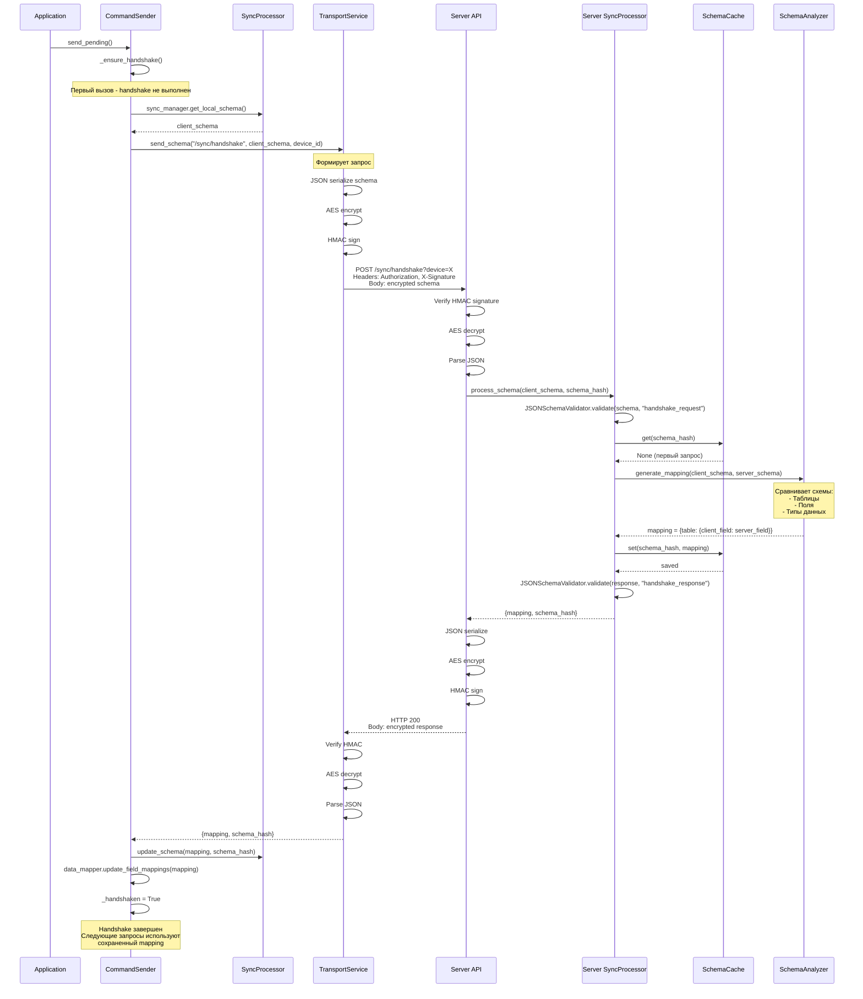
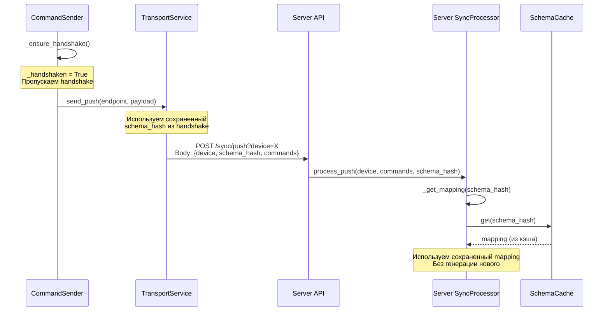
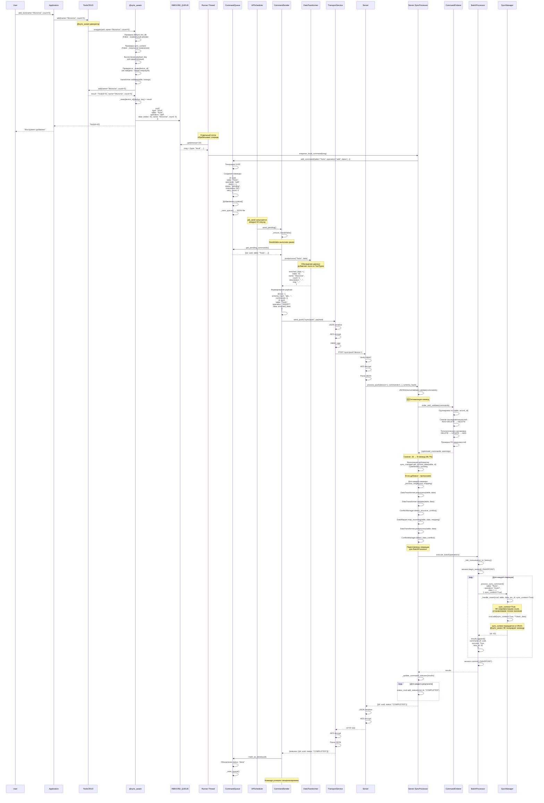
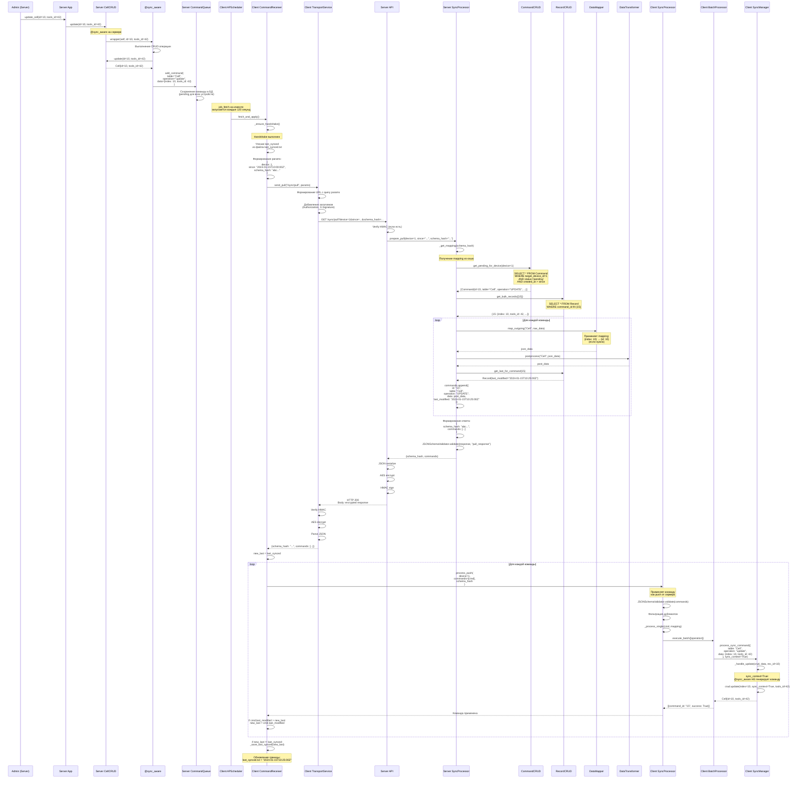
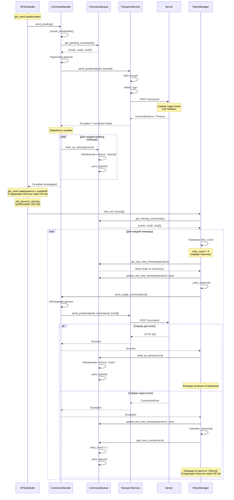
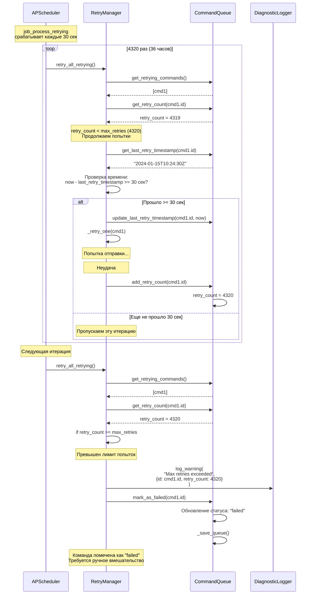
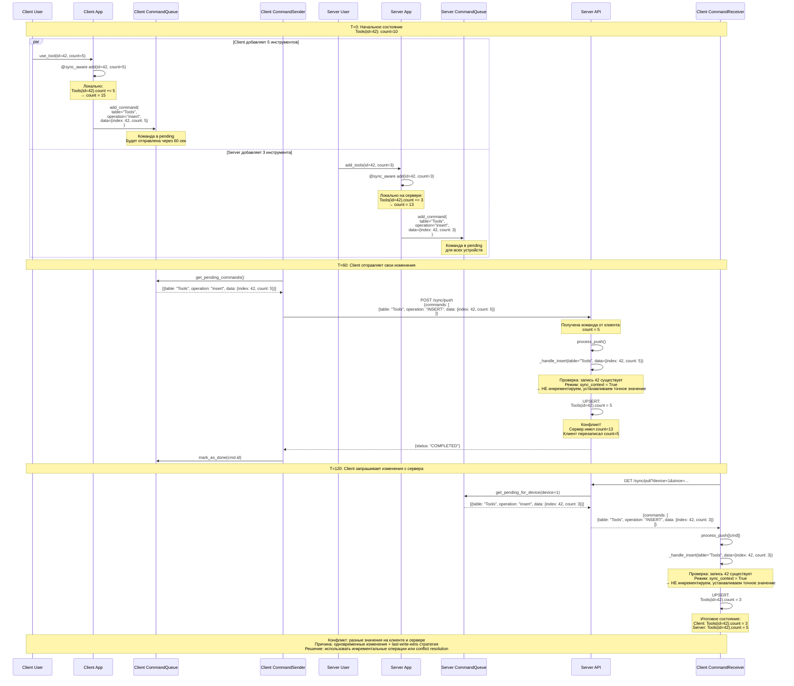
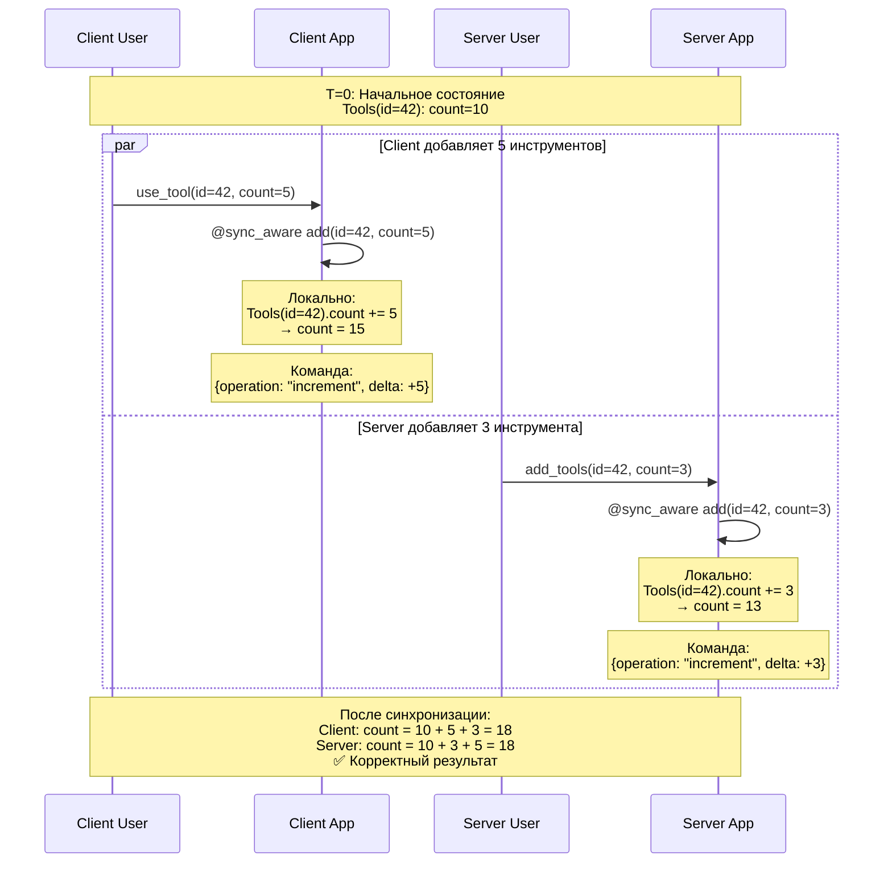

# Диаграммы последовательностей системы синхронизации

## Оглавление

1. [Handshake - согласование схем](#handshake---согласование-схем)
2. [Push - отправка локальных изменений](#push---отправка-локальных-изменений)
3. [Pull - получение удаленных изменений](#pull---получение-удаленных-изменений)
4. [Обработка ошибок и повторы](#обработка-ошибок-и-повторы)
5. [Полный цикл двусторонней синхронизации](#полный-цикл-двусторонней-синхронизации)

---

## Handshake - согласование схем

### Инициация handshake (первый запрос)



### Повторный запрос (mapping в кэше)



---

## Push - отправка локальных изменений

### Сценарий: Пользователь добавляет инструмент



---

## Pull - получение удаленных изменений

### Сценарий: Сервер изменяет ячейку, клиент получает обновление



---

## Обработка ошибок и повторы

### Сценарий: Сетевая ошибка при отправке команды



### Сценарий: Превышение max_retries



---

## Полный цикл двусторонней синхронизации

### Сценарий: Одновременные изменения на клиенте и сервере



### Правильный сценарий с инкрементальными операциями



---

## Диаграмма компонентов и их взаимодействия

```
┌─────────────────────────────────────────────────────────────────┐
│                       Application Layer                         │
├─────────────────────────────────────────────────────────────────┤
│  User Interaction → CRUD Operations → @sync_aware Decorator     │
└────────────────────────────┬────────────────────────────────────┘
                             │
                             ▼
┌─────────────────────────────────────────────────────────────────┐
│                       Capture Layer                              │
├─────────────────────────────────────────────────────────────────┤
│  • Дедупликация операций (_state cache)                         │
│  • Валидация данных (DataTransformer)                           │
│  • Генерация команд (INBOUND_QUEUE)                             │
└────────────────────────────┬────────────────────────────────────┘
                             │
                             ▼
┌─────────────────────────────────────────────────────────────────┐
│                       Queue Layer                                │
├─────────────────────────────────────────────────────────────────┤
│  • CommandQueue (JSON persistence)                              │
│  • Статусы: pending → retrying → done / failed                  │
│  • Retry tracking (retry_count, last_retry_timestamp)           │
└────────────────────────────┬────────────────────────────────────┘
                             │
                             ▼
┌─────────────────────────────────────────────────────────────────┐
│                       Scheduling Layer                           │
├─────────────────────────────────────────────────────────────────┤
│  APScheduler Jobs:                                               │
│  • job_send (60s) → CommandSender.send_pending()                │
│  • job_fetch (120s) → CommandReceiver.fetch_and_apply()         │
│  • job_process_retrying (30s) → RetryManager.retry_all()        │
└──────────────┬─────────────────────────────┬────────────────────┘
               │                             │
               ▼                             ▼
┌──────────────────────────┐   ┌────────────────────────────────┐
│   Push Process (PUSH)    │   │   Pull Process (PULL)          │
├──────────────────────────┤   ├────────────────────────────────┤
│ CommandSender            │   │ CommandReceiver                │
│   ↓                      │   │   ↓                            │
│ DataTransformer          │   │ TransportService               │
│   (enrich)               │   │   ↓                            │
│   ↓                      │   │ Server API                     │
│ TransportService         │   │   ↓                            │
│   (encrypt + sign)       │   │ SyncProcessor.prepare_pull()   │
│   ↓                      │   │   ↓                            │
│ Server API               │   │ DataMapper + DataTransformer   │
│   ↓                      │   │   ↓                            │
│ SyncProcessor            │   │ TransportService               │
│   .process_push()        │   │   (decrypt + verify)           │
│   ↓                      │   │   ↓                            │
│ 🆕 CommandOrderer        │   │ CommandReceiver                │
│   (optimize + order)     │   │   ↓                            │
│   ↓                      │   │ SyncProcessor.process_push()   │
│ BatchProcessor           │   │   ↓                            │
│   ↓                      │   │ 🆕 CommandOrderer              │
│ SyncManager → Database   │   │   (optimize + order)           │
└──────────────────────────┘   │   ↓                            │
                               │ BatchProcessor                 │
                               │   ↓                            │
                               │ SyncManager → Database         │
                               └────────────────────────────────┘

┌─────────────────────────────────────────────────────────────────┐
│                   🆕 Optimization Layer                          │
├─────────────────────────────────────────────────────────────────┤
│  CommandOrderer (интеллектуальная обработка):                   │
│    • Группировка по (table, record_id)                          │
│    • Сжатие последовательностей: ADD+DELETE → DELETE            │
│    • Валидация корректности операций                            │
│    • Топологическая сортировка по FK                            │
│    • Результат: сокращение команд на 30-80%                     │
└─────────────────────────────────────────────────────────────────┘

┌─────────────────────────────────────────────────────────────────┐
│                       Core Processing Layer                      │
├─────────────────────────────────────────────────────────────────┤
│  SyncProcessor (координация):                                   │
│    • Handshake (SchemaCache + SchemaAnalyzer)                   │
│    • Push processing (валидация, трансформация, конфликты)     │
│    • Pull preparation (команды из БД)                           │
│    • 🆕 Оптимизация через CommandOrderer                        │
│                                                                  │
│  BatchProcessor (транзакции):                                   │
│    • Атомарная обработка операций                               │
│    • Автосвязывание (Consumption ↔ History)                     │
│                                                                  │
│  SyncManager (CRUD-фасад):                                      │
│    • process_command → _handle_insert/update/delete             │
│    • UPSERT логика                                              │
│    • Специальная обработка (count increment, автосвязи)         │
└─────────────────────────────────────────────────────────────────┘

┌─────────────────────────────────────────────────────────────────┐
│                       Support Components                         │
├─────────────────────────────────────────────────────────────────┤
│  • DataMapper: маппинг полей между схемами                      │
│  • DataTransformer: бизнес-правила (enrich, validate)           │
│  • ConflictManager: обнаружение и разрешение конфликтов         │
│  • RetryManager: планирование повторов                          │
│  • 🆕 CommandOrderer: оптимизация и упорядочивание команд       │
│  • DiagnosticLogger: централизованное логирование               │
│  • SyncMonitor: метрики (success/failure counts, duration)      │
│  • JSONSchemaValidator: валидация по JSON Schema                │
└─────────────────────────────────────────────────────────────────┘
```

---

## Заключение

Эти диаграммы последовательностей иллюстрируют:

1. **Handshake** - процесс согласования схем между клиентом и сервером с кэшированием
2. **Push** - полный цикл отправки локальных изменений на сервер с оптимизацией 🆕
3. **Pull** - получение удаленных изменений с сервера
4. **Retry** - обработка ошибок с автоматическими повторами
5. **Bidirectional** - двустороннюю синхронизацию с обработкой конфликтов
6. **Optimization** - интеллектуальная оптимизация команд (сжатие 30-80%) 🆕

Система обеспечивает надежную доставку команд, автоматическое разрешение конфликтов, интеллектуальную оптимизацию и безопасность данных через шифрование и подпись.

